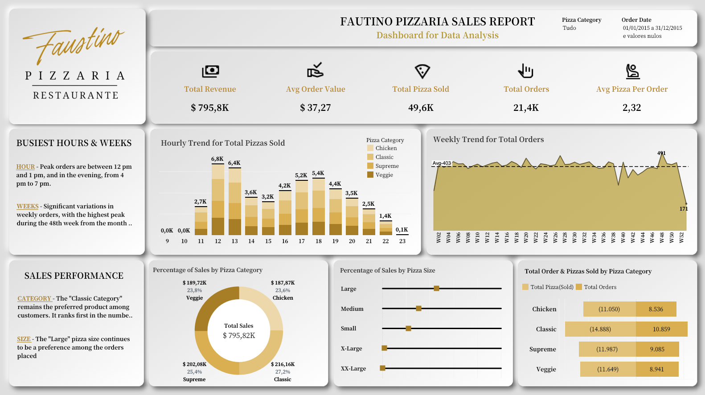

# Pizzeria-Data-Analysis


O projeto envolve uma análise abrangente das vendas de uma pizzaria, fazendo uso das ferramentas MySQL e Tableau. A análise se concentra em identificar tendências, padrões e insights nos dados de vendas, abrangendo aspectos como o desempenho ao longo do tempo, preferências dos clientes, sazonalidade e produtos mais populares do menu. O objetivo central é fornecer informações acionáveis que possam auxiliar a pizzaria na otimização de suas operações e no aumento do sucesso no mercado de alimentos.

## Tableau


[ ](https://public.tableau.com/app/profile/vin.cius.braga.matta/viz/Pizzeria_Analysis/Painel1#1) 

## Estrutura do Repositório

```bash

├── DATA/
    ├── data_base
    ├── data_cleaned
├── Problem Statement
    ├── KPI's(SQL)
    ├── Charts Requirement(SQL)
    ├── README(KPI's)

```

## Contribuições

Se você deseja contribuir com suas próprias soluções ou melhorar as soluções existentes, sinta-se à vontade para fazer um fork deste repositório, criar um branch com suas alterações e enviar um pull request. Sua contribuição será apreciada!

## Licença

Este projeto é licenciado sob a [Licença MIT](LICENSE.md) - consulte o arquivo LICENSE.md para obter detalhes.

Happy coding!
